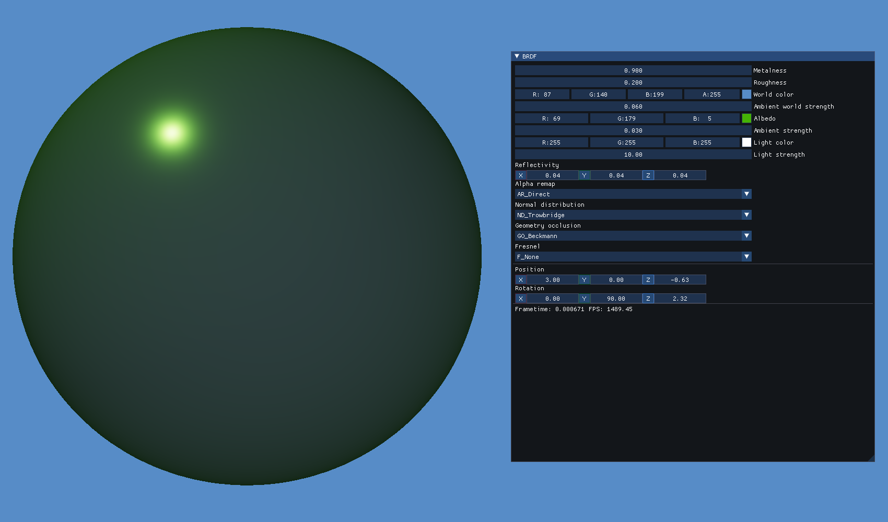
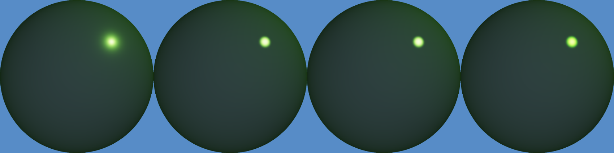

# Bidirectional reflectance distribution function

***!Note***: this implemetation is not strictly correct as ambient light is accounted for in the following way:
```glsl
vec3 ambient = u_Ambient * albedo + (u_AmbientWorld * u_World.xyz * dot(normal, view));
```
Where *u_Ambient* is the object ambient strength and *u_AmbientWorld* is the world ambient strength.





Normal distribution | Geometry occlusion | Fresnel
:---: | :---: | :---:
Trowbridge-Reitz | Beckmann | None
Blinn-Phong | Smith | Cook-Torrance
Beckmann | Beckmann | None
Beckmann | Cook-Torrance | Schlick

*From left to right*

References:
* [Specular BRDF](http://graphicrants.blogspot.com/2013/08/specular-brdf-reference.html)